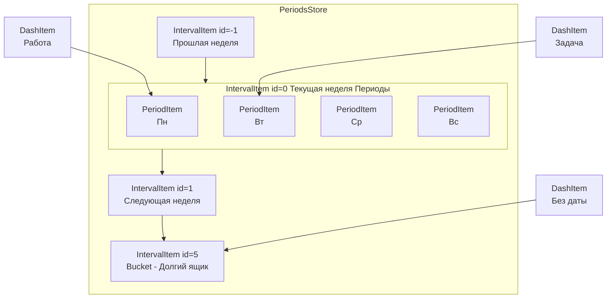
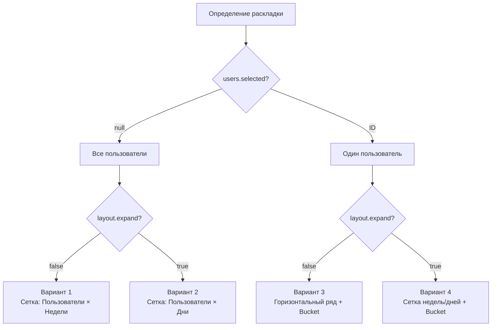
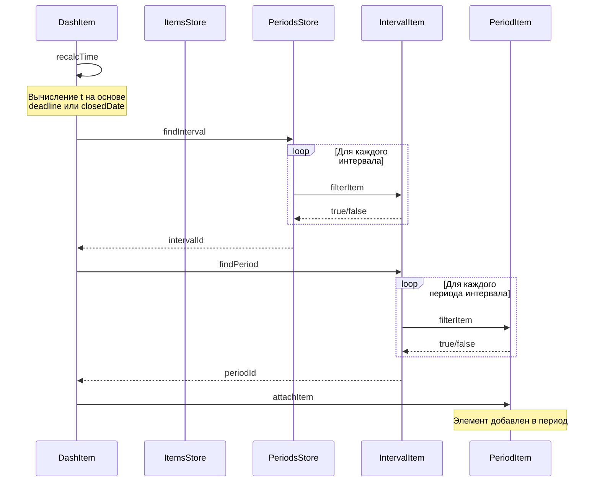
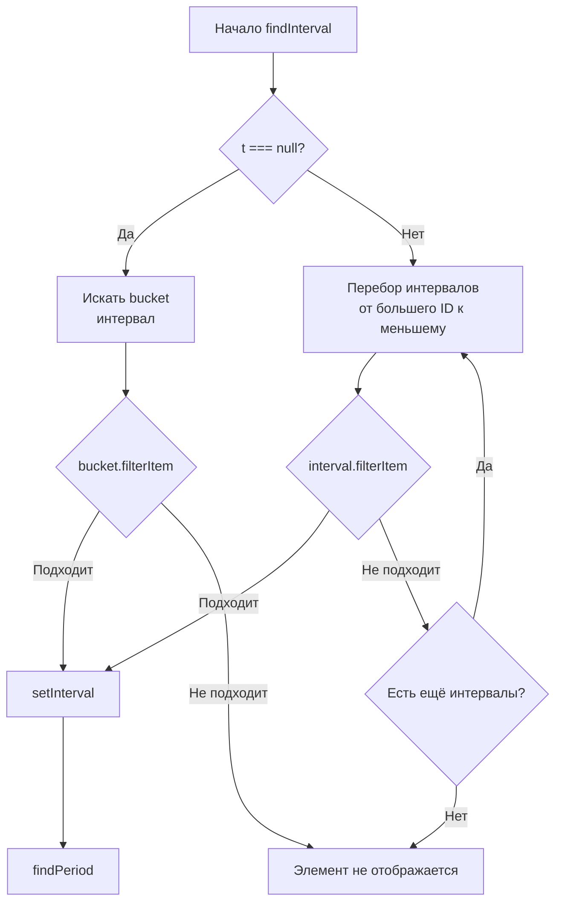
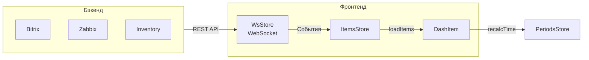
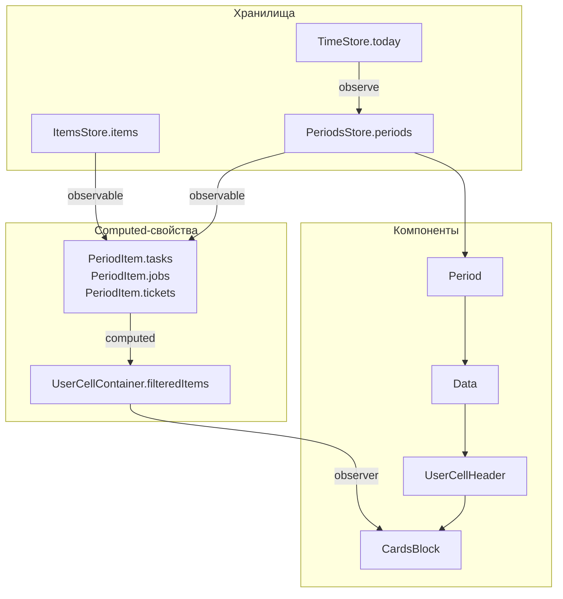
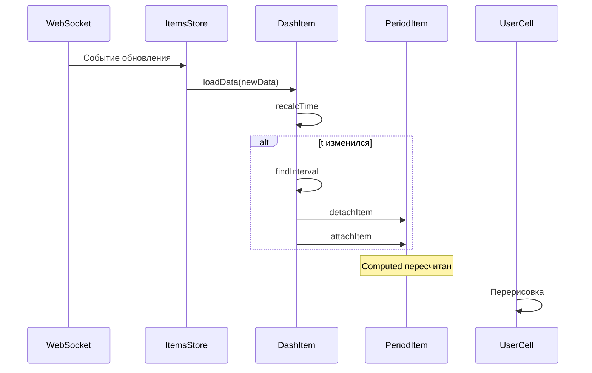
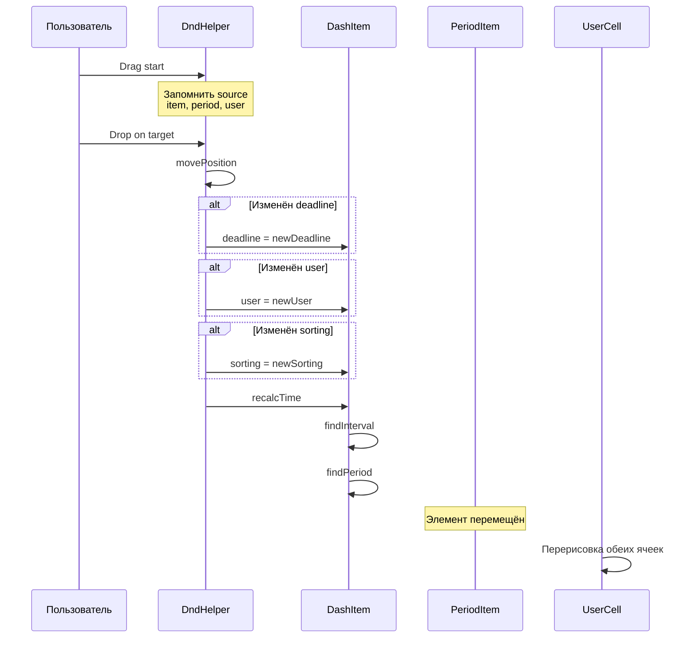

# Архитектура распределения элементов по сетке дата/пользователь

## Введение

Данный документ описывает архитектуру системы распределения элементов (задач, работ, заявок, планов, записок) по двумерной сетке "дата/пользователь" в приложении bxDash. Документ предназначен для разработчиков, которые впервые знакомятся с проектом и хотят понять, как элементы попадают в ячейки сетки и как происходит обновление интерфейса при изменениях.

**Ключевые файлы проекта:**

- [`DashItem.jsx`](src/Data/Items/DashItem.jsx) — базовый класс элемента
- [`IntervalItem.jsx`](src/Data/Stores/Periods/IntervalItem.jsx) — недельный интервал
- [`PeriodItem.jsx`](src/Data/Stores/Periods/PeriodItem.jsx) — период (день/неделя)
- [`ItemsStore.jsx`](src/Data/Stores/Items/ItemsStore.jsx) — хранилище элементов
- [`UserCellContainer.jsx`](src/Components/Layout/Interval/Period/Data/UserCell/UserCellContainer.jsx) — контейнер ячейки пользователя

---

## Концептуальная модель

### Иерархия временных контейнеров



---

## Варианты раскладок интерфейса

Интерфейс bxDash поддерживает 4 варианта раскладки, которые формируются комбинацией двух параметров.

### Параметры раскладки

| Параметр | Расположение в коде | Значения |
|----------|---------------------|----------|
| **Разбивка недель** | [`LayoutStore.expand`](src/Data/Stores/LayoutStore.jsx:14) | `true` — недели разбиты на дни  `false` — одна неделя = одна ячейка |
| **Фильтр пользователей** | [`UsersStore.selected`](src/Data/Stores/UsersStore.jsx:26) | `null` — все пользователи  `ID` — выбран конкретный пользователь |

### Матрица вариантов раскладки

```text
                           │ users.selected = null    │ users.selected = ID      │
                           │ (все пользователи)       │ (один пользователь)      │
───────────────────────────┼──────────────────────────┼──────────────────────────┤
 layout.expand = false     │ ВАРИАНТ 1                │ ВАРИАНТ 3                │
 (недели не разбиты)       │ Сетка: пользователи ×    │ Горизонтальный ряд       │
                           │ недели                   │ недель + Долгий ящик     │
───────────────────────────┼──────────────────────────┼──────────────────────────┤
 layout.expand = true      │ ВАРИАНТ 2                │ ВАРИАНТ 4                │
 (недели разбиты на дни)   │ Сетка: пользователи ×    │ Комбинированная сетка    │
                           │ дни                      │ недель/дней + Долгий ящик│
```

---

### Вариант 1: Все пользователи + недели не разбиты

**Структура:** Двумерная сетка

- **Ось X:** Пользователи (колонки)
- **Ось Y:** Время (ряды сверху вниз: прошлые периоды → будущие)
- **Ячейка:** Одна неделя для конкретного пользователя

```text
Сетка: X - пользователи, Y - время (вниз от прошлого к будущему)
Каждая ячейка - неделя для пользователя

    ┌─────────┬─────────┬─────────┬─────────┐
    │  User1  │  User2  │  User3  │  User4  │  ← пользователи (ось X)
    ├─────────┼─────────┼─────────┼─────────┤
    │ Неделя1 │ Неделя1 │ Неделя1 │ Неделя1 │
    ├─────────┼─────────┼─────────┼─────────┤
    │ Неделя2 │ Неделя2 │ Неделя2 │ Неделя2 │  ← время (ось Y, вниз)
    ├─────────┼─────────┼─────────┼─────────┤
    │ Неделя3 │ Неделя3 │ Неделя3 │ Неделя3 │
    ├─────────┼─────────┼─────────┼─────────┤
    │  User1  │  User2  │  User3  │ User 4  │
    │ Bucket  │ Bucket  │ Bucket  │ Bucket  │  ← Элементы без назначенной даты
    └─────────┴─────────┴─────────┴─────────┘
```

**Направление прокрутки:** Вертикальная (по времени)

---

### Вариант 2: Все пользователи + недели разбиты на дни

**Структура:** Двумерная сетка с детализацией по дням

- **Ось X:** Пользователи (колонки)
- **Ось Y:** Время (ряды сверху вниз: прошлые периоды → будущие)
- **Ячейка:** Один день для конкретного пользователя

```text
Сетка: X - пользователи, Y - время (вниз от прошлого к будущему)
Каждая ячейка - день для пользователя

    ┌─────────┬─────────┬─────────┬─────────┐
    │  User1  │  User2  │  User3  │  User4  │  ← пользователи (ось X)
    ├─────────┼─────────┼─────────┼─────────┤
    │  Пн W1  │  Пн W1  │  Пн W1  │  Пн W1  │
    ├─────────┼─────────┼─────────┼─────────┤
    │  Вт W1  │  Вт W1  │  Вт W1  │  Вт W1  │
    ├─────────┼─────────┼─────────┼─────────┤
    │  ...    │  ...    │  ...    │  ...    │  ← время (ось Y, вниз)
    ├─────────┼─────────┼─────────┼─────────┤
    │  Пн W2  │  Пн W2  │  Пн W2  │  Пн W2  │
    ├─────────┼─────────┼─────────┼─────────┤
    │  User1  │  User2  │  User3  │ User 4  │
    │ Bucket  │ Bucket  │ Bucket  │ Bucket  │  ← Элементы без назначенной даты
    └─────────┴─────────┴─────────┴─────────┘
```

**Направление прокрутки:** Вертикальная (по времени)

---

### Вариант 3: Выбранный пользователь + недели не разбиты

**Структура:** Горизонтальный ряд ячеек

- **Ось X:** Время (слева направо: прошлые периоды → будущие)
- **Ось Y:** Отсутствует (один пользователь)
- **Ячейка:** Одна неделя для выбранного пользователя
- **Особенность:** Справа закреплена ячейка "Долгий ящик" на всю высоту

```text
Горизонтальный ряд ячеек + закреплённый "Долгий ящик" справа
Ось X - время (слева прошлое, справа будущее)

    ┌──────────┬──────────┬──────────┬──────────┬──────────────┐
    │ Неделя1  │ Неделя2  │ Неделя3  │ Неделя4  │   Долгий     │
    │          │          │          │          │    ящик      │
    └──────────┴──────────┴──────────┴──────────┴──────────────┘
         ↑                                    ↑
      прошлое                              будущее
```

**Направление прокрутки:** Горизонтальная (по времени)

**Особенности:**

- Ячейка "Долгий ящик" всегда видна (закреплена справа)
- Прокрутка осуществляется горизонтально
- Временная ось направлена слева направо (прошлое → будущее)

---

### Вариант 4: Выбранный пользователь + недели разбиты на дни

**Структура:** Комбинированная сетка

- **Справа:** Закреплённая ячейка "Долгий ящик" во всю высоту
- **Основная часть:** Сетка недель
  - **Ряды (сверху вниз):** Недели от прошлых периодов к будущим
  - **Колонки внутри ряда (слева направо):** Дни недели (Пн–Вс)
- **Ячейка:** Один день для выбранного пользователя

```text
Комбинированная сетка: справа закреплён "Долгий ящик"
Основная часть: ряды недель, внутри - дни (пн-вс)

    ┌───────────────────────────────────────┬──────────────┐
    │  Неделя1                              │              │
    │  ┌────┬────┬────┬────┬────┬────┬────┐ │              │
    │  │ Пн │ Вт │ Ср │ Чт │ Пт │ Сб │ Вс │ │              │
    │  └────┴────┴────┴────┴────┴────┴────┘ │              │
    ├───────────────────────────────────────┤   Долгий     │
    │  Неделя2                              │    ящик      │
    │  ┌────┬────┬────┬────┬────┬────┬────┐ │              │
    │  │ Пн │ Вт │ Ср │ Чт │ Пт │ Сб │ Вс │ │              │
    │  └────┴────┴────┴────┴────┴────┴────┘ │              │
    ├───────────────────────────────────────┤              │
    │  Неделя3                              │              │
    │  ...                                  │              │
    └───────────────────────────────────────┴──────────────┘

```

**Направление прокрутки:** Вертикальная (по неделям)

**Особенности:**

- Дни недели расположены горизонтально внутри каждой недели
- Недели расположены вертикально
- "Долгий ящик" закреплён справа и всегда виден

---

### Логика выбора раскладки

Выбор варианта раскладки определяется в компонентах на основе текущих значений параметров:



### Влияние на прокрутку

Направление прокрутки зависит от выбранного варианта:

| Вариант | Направление прокрутки | Метод прокрутки |
|---------|----------------------|-----------------|
| 1, 2 | Вертикальное | [`scrollToday()`](src/Data/Stores/LayoutStore.jsx:80) |
| 3 | Горизонтальное | [`scrollTo()`](src/Data/Stores/LayoutStore.jsx:68) с `horizontal: true` |
| 4 | Вертикальное | [`scrollToday()`](src/Data/Stores/LayoutStore.jsx:80) |

Логика определения направления прокрутки реализована в [`LayoutStore.scrollTo()`](src/Data/Stores/LayoutStore.jsx:75):

- `horizontal: !this.expand && this.users.selected !== null` — горизонтальная прокрутка только для Варианта 3

---

## Структура данных

### Временные периоды

#### IntervalItem — недельный интервал

**Назначение:** Группирует элементы по неделям. Содержит несколько PeriodItem.

| Поле | Тип | Описание |
|------|-----|----------|
| `id` | number | Номер недели относительно текущей (0 = текущая, -1 = прошлая) |
| `start` | timestamp | Начало интервала (понедельник 00:00) |
| `end` | timestamp \| null | Конец интервала (воскресенье 00:00) или null для bucket |
| `periodsIds` | number[] | Массив start-ов периодов этого интервала |
| `itemsIds` | ItemsIdsStore | Хранилище ID элементов в этом интервале |

**Особенности:**

- Интервал с `id > weekMax` является "Долгим ящиком" (bucket) — имеет `end = null`
- Принимает элементы без даты или с датой за пределами отображаемого диапазона

#### PeriodItem — период (день/неделя)

**Назначение:** Отображает конкретный временной период и содержит элементы.

| Поле | Тип | Описание |
| ---- | --- | -------- |
| `start` | timestamp | Начало периода |
| `len` | timestamp \| null | Длина периода (день/неделя/null) |
| `end` | timestamp \| null | `start + len` или null для bucket |
| `type` | string | 'day' или 'week' |
| `title` | string | Текст для заголовка |
| `className` | string | CSS-класс для раскраски |
| `isOpen` | boolean | Период ещё не закончился |
| `isClosed` | boolean | Период уже начался |
| `isToday` | boolean | Сегодняшний день |
| `dropTime` | timestamp | Время для позиционирования при DnD |

### Пользователи

#### UsersStore — хранилище пользователей

| Поле | Тип | Описание |
| ---- | --- | -------- |
| `items` | Map<ID, UserItem> | Карта пользователей по ID |
| `order` | ID[] | Порядок отображения |
| `current` | ID | Текущий пользователь |
| `selected` | ID[] | Выбранные пользователи |

### Элементы

#### DashItem — базовый класс элемента

**Назначение:** Базовый класс для всех типов элементов (Task, Job, Ticket, Plan, Memo).

| Поле | Тип | Описание |
|------|-----|----------|
| `id` | number | Уникальный идентификатор |
| `type` | string | Тип элемента: 'task', 'job', 'ticket', 'plan', 'memo' |
| `uid` | string | Уникальный ID в формате "type:id" |
| `user` | ID | ID ответственного пользователя |
| `t` | timestamp \| null | Временная отметка для позиционирования |
| `deadline` | timestamp \| null | Дедлайн |
| `closedDate` | timestamp \| null | Дата закрытия |
| `intervalId` | number | ID интервала, в котором находится элемент |
| `periodId` | timestamp | Start периода, в котором находится элемент |
| `sorting` | number | Порядок внутри ячейки |

**Производные классы:**

- [`TaskItem`](src/Data/Items/TaskItem.jsx) — задача
- [`JobItem`](src/Data/Items/JobItem.jsx) — работа
- [`TicketItem`](src/Data/Items/TicketItem.jsx) — заявка
- [`PlanItem`](src/Data/Items/PlanItem.jsx) — план
- [`MemoItem`](src/Data/Items/MemoItem.jsx) — записка

#### ItemsStore — хранилище элементов

| Поле | Тип | Описание |
|------|-----|----------|
| `items` | Map<ID, DashItem> | Карта элементов по ID |
| `type` | string | Тип хранимых элементов |

| Метод | Описание |
|-------|----------|
| `loadItems(from, to)` | Загрузка элементов за период |
| `addItem(data)` | Создание элемента |
| `deleteItem(id)` | Удаление элемента |

#### ItemsMultiStore — агрегация хранилищ

Объединяет хранилища разных типов элементов для общей работы.

---

## Механизм распределения элементов

### Алгоритм позиционирования

Элемент попадает в ячейку сетки в результате последовательности вызовов:



### Вычисление временной отметки (recalcTime)

Логика определения `t`:

1. **Закрытый элемент** (`closedDate` задан):
   - `t = closedDate` — позиционируем по дате закрытия

2. **Открытый элемент** (`deadline` задан):
   - `t = max(deadline, today)` — если дедлайн в прошлом, элемент "съезжает" на сегодня

3. **Элемент без даты**:
   - `t = null` — попадает в "Долгий ящик"

### Поиск интервала (findInterval)



### Фильтрация элемента в период (PeriodItemsMixin.filterItem)

Элемент попадает в период, если его временная отметка `t` находится в диапазоне `[period.start, period.end)`:

```text
period.start <= item.t < period.end
```

Для bucket (`end === null`):

- Элементы с `t >= lastPeriod.end` — попадают в bucket
- Элементы с `t === null` — попадают в bucket

### Фильтрация по пользователю (UserCellContainer)

После определения периода элемент фильтруется по пользователю:

1. **Основной ответственный**: `item.user === userId`
2. **Соисполнители**: элемент может отображаться в ячейках нескольких пользователей

---

## Потоки данных

### Загрузка данных



### Последовательность обновления при загрузке

1. **WebSocket** получает данные от бэкенда
2. **WsStore** парсит сообщение и вызывает соответствующий ItemsStore
3. **ItemsStore** создаёт/обновляет DashItem через `loadData()`
4. **DashItem.loadData()** вызывает `recalcTime()`
5. **recalcTime()** вычисляет `t` и вызывает `findInterval()`
6. **findInterval()** находит подходящий IntervalItem
7. **findPeriod()** находит подходящий PeriodItem внутри интервала
8. **PeriodItem** добавляет элемент в свой список через `attachItem()`
9. **MobX** обнаруживает изменение и перерисовывает UserCell

---

## Каскад обновлений компонент

### Реактивная цепочка MobX



### Обновление при смене дня

Когда `TimeStore.today` изменяется (например, при переходе через полночь):

1. **TimeStore** обновляет `today`, `monday0`, `sunday0`
2. **PeriodsStore** реагирует на `observe(time, 'today')` → `weeksInit()`
3. **IntervalItem.init()** пересчитывает границы интервалов
4. **IntervalItem.reinitPeriods()** пересоздаёт PeriodItem
5. **IntervalItem.reintervalItems()** перераспределяет элементы
6. **PeriodItem** computed-свойства пересчитываются
7. **UserCell** перерисовывается

### Обновление при изменении элемента



---

## Drag-and-drop

### Перемещение элемента



### Определение позиции при drop

При бросании элемента в ячейку:

1. **dropTime** — время для позиционирования (18:00 для дня, пятница 18:00 для недели)
2. **deadline** устанавливается равным `dropTime`
3. **sorting** вычисляется на основе позиции среди других элементов в ячейке

### Обновление затронутых ячеек

После перемещения перерисовываются:
- **Исходная ячейка** — элемент удалён
- **Целевая ячейка** — элемент добавлен
- **Ячейки соисполнителей** — если изменился состав участников

---

## Оптимизации производительности

### Computed-свойства PeriodItem

PeriodItem использует computed-свойства для кэширования отфильтрованных списков:

| Свойство | Описание |
|----------|----------|
| `tasks` | Список TaskItem в периоде |
| `jobs` | Список JobItem в периоде |
| `tickets` | Список TicketItem в периоде |
| `plans` | Список PlanItem в периоде |
| `memos` | Список MemoItem в периоде |

**Преимущество:** Списки вычисляются только при изменении элементов, а не при каждой перерисовке.

### Observer-паттерн в компонентах

Компоненты обёрнуты в `observer()` из mobx-react:

- **UserCellContainer** — перерисовывается только при изменении фильтруемых элементов
- **CardsBlock** — перерисовывается при изменении списка элементов
- **Period** — перерисовывается при изменении свойств периода

### Ленивое обновление интервалов

- Интервалы создаются только для отображаемого диапазона недель (`weekMin`..`weekMax`)
- При прокрутке диапазона старые интервалы удаляются, новые создаются
- Элементы автоматически перераспределяются при изменении диапазона

### Избегание лишних перерисовок

1. **Сравнение t** — `recalcTime()` вызывает `findInterval()` только если `t` изменился
2. **Сравнение intervalId/periodId** — привязка обновляется только при реальном изменении
3. **Глубокое сравнение** — `observable.struct` для объектов, где важно глубокое сравнение

---

## Связанные документы

- [`intervals.md`](intervals.md) — детальное описание хранилищ интервалов и периодов
- [`analysis.md`](analysis.md) — анализ проблемных мест проекта
- [`AGENTS.md`](../AGENTS.md) — руководство по разработке

---

*Документ создан: 2026-02-22*
