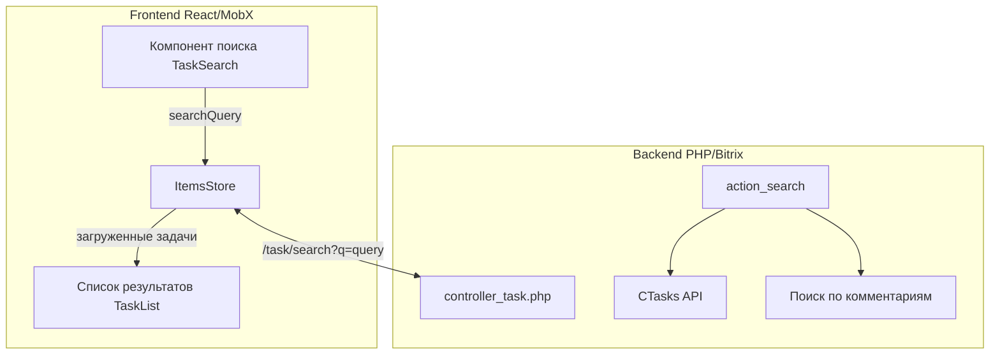

# План реализации функционала поиска задач

## Обзор

Реализация функционала полнотекстового поиска задач по заголовку, содержимому (описанию) и тексту комментариев. Поиск выполняет запрос к бэкенду и возвращает задачи в стандартном формате, аналогичном обычной загрузке. Результаты отображаются в виде списка задач.

## Архитектура решения



## Этапы реализации

### Этап 1: Backend - action_search в controller_task.php

**Цель:** Создать endpoint для поиска задач в Bitrix по заголовку, описанию и комментариям.

- [ ] Создать метод `action_search()` в [`controller_task.php`](back/app/ctl/controller_task.php:6)
- [ ] Получать параметр поискового запроса `q` из GET (минимум 3 символа)
- [ ] Реализовать поиск задач через `CTasks::GetList` с фильтром:
  - `TITLE` - поиск по подстроке (`%TITLE`)
  - `DESCRIPTION` - поиск по подстроке (`%DESCRIPTION`)
- [ ] Реализовать поиск задач по комментариям через `CTaskComments`:
  - Получить ID задач, у которых в комментариях есть совпадения
  - Объединить с результатами поиска по TITLE/DESCRIPTION
- [ ] Вернуть задачи в стандартном формате (тот же набор полей что и `action_load`)
- [ ] Использовать `CHECK_PERMISSIONS => 'Y'` для проверки прав доступа
- [ ] Добавить ограничение на количество результатов (например, 100 задач)

**API Endpoint:** `GET /task/search?q={searchQuery}`

**Формат ответа:** Аналогичен `action_load` - массив задач в формате Bitrix:
```json
[
  {
    "ID": 123,
    "TITLE": "Заголовок задачи",
    "DESCRIPTION": "Описание задачи",
    "RESPONSIBLE_ID": 456,
    "REAL_STATUS": 3,
    ...остальные поля из $fieldsMap
  }
]
```

**Важно:** Комментарии не загружаются - только ID задач для отображения списка.

### Этап 2: Методы поиска в ItemsStore

**Цель:** Добавить логику поиска в хранилище задач.

- [ ] Добавить свойства в [`ItemsStore.jsx`](src/Data/Stores/Items/ItemsStore.jsx:12):
  - `searchQuery` - строка поиска
  - `searchResults` - массив ID найденных задач
  - `isSearching` - флаг выполнения поиска
  - `searchMode` - boolean, активен ли режим поиска
- [ ] Создать action `setSearchQuery(query)`
- [ ] Создать action `setSearchMode(value)`
- [ ] Создать асинхронный action `searchTasks(query)`:
  - Установить `isSearching = true`
  - Выполнить запрос к `/task/search?q=${encodeURIComponent(query)}`
  - Полученные задачи загрузить через существующий `initData`
  - Сохранить ID найденных задач в `searchResults`
  - Установить `searchMode = true`
  - Установить `isSearching = false`
- [ ] Создать action `clearSearch()`:
  - Очистить `searchQuery`
  - Очистить `searchResults`
  - Установить `searchMode = false`
- [ ] Обновить `makeObservable` с новыми свойствами

### Этап 3: Компонент поиска TaskSearch

**Цель:** Создать UI компонент для ввода поискового запроса.

- [ ] Создать директорию `src/Components/Layout/TaskSearch/`
- [ ] Создать компонент `TaskSearch.jsx`:
  - Поле ввода с debounce (300-500мс)
  - Кнопка "Найти" (лупа) для немедленного поиска
  - Кнопка "Очистить" (крестик) для сброса поиска
  - Индикатор загрузки (spinner) при `isSearching`
  - Отображение количества найденных результатов
- [ ] Создать стили `TaskSearch.css`
- [ ] Использовать Ant Design: `Input`, `Button`, `Spin`, `Badge`
- [ ] Интегрировать с `StoreContext`
- [ ] Валидация: минимум 3 символа для поиска

**Место размещения:** В шапке приложения рядом с [`AppHeader.jsx`](src/Components/Layout/Header/AppHeader.jsx:1)

### Этап 4: Отображение результатов поиска

**Цель:** Показывать найденные задачи в отдельной панели результатов.

- [ ] Создать компонент `SearchResults.jsx` в `src/Components/Layout/SearchResults/`
- [ ] Компонент отображает список найденных задач используя существующие `TaskCard`
- [ ] Добавить заголовок "Результаты поиска: N задач"
- [ ] Добавить кнопку "Закрыть результаты" (вызывает `clearSearch()`)
- [ ] Обновить [`Layout.jsx`](src/Components/Layout/Layout.jsx:22):
  - При `searchMode === true` показывать `SearchResults` вместо/поверх календаря
  - Или отображать результаты в модальном окне / сайдбаре
- [ ] При клике на задачу в результатах:
  - Закрыть режим поиска
  - Прокрутить к периоду где находится задача
  - Подсветить задачу через `flashItem()`

### Этап 5: Интеграция в Layout

**Цель:** Интегрировать компоненты поиска в основной layout.

- [ ] Обновить [`Layout.jsx`](src/Components/Layout/Layout.jsx:22):
  - Добавить `<TaskSearch />` в шапку
  - Добавить условное отображение `<SearchResults />` при `searchMode`
- [ ] Обновить [`ItemsMultiStore.jsx`](src/Data/Stores/Items/ItemsMultiStore.jsx:6):
  - Проксировать методы поиска к `this.task`
- [ ] Проверить работу с `observer` для реактивного обновления UI

### Этап 6: Тестирование и обработка ошибок

**Цель:** Обеспечить корректную работу всех компонентов.

- [ ] Добавить обработку ошибок сети при поиске (try-catch)
- [ ] Добавить сообщение "Ничего не найдено" при пустых результатах
- [ ] Добавить сообщение "Введите минимум 3 символа"
- [ ] Проверить работу debounce (не отправлять запросы при каждом символе)
- [ ] Проверить ограничение на количество результатов (>100)
- [ ] Проверить безопасность: пользователь видит только задачи по правам доступа

## Технические детали

### Backend action_search

```php
public function action_search() {
    $query = $_GET['q'] ?? '';
    if (strlen($query) < 3) {
        router::haltJson('Query too short');
    }
    
    $resultIds = [];
    
    // Поиск по TITLE и DESCRIPTION
    $filter = [
        '::LOGIC' => 'OR',
        '%TITLE' => $query,
        '%DESCRIPTION' => $query,
        'CHECK_PERMISSIONS' => 'Y',
    ];
    $res = CTasks::GetList([], $filter, self::$fieldsMap);
    while ($arTask = $res->GetNext()) {
        $resultIds[$arTask['ID']] = $arTask;
    }
    
    // Поиск по комментариям (получаем ID задач)
    $taskIdsFromComments = $this->searchInComments($query);
    foreach ($taskIdsFromComments as $taskId) {
        if (!isset($resultIds[$taskId])) {
            // Загрузить задачу если еще не в результатах
            $task = CTasks::GetByID($taskId, true, self::$fieldsMap);
            if ($task) {
                $resultIds[$taskId] = $task;
            }
        }
    }
    
    // Ограничение количества результатов
    $resultIds = array_slice($resultIds, 0, 100, true);
    
    // Инициализация данных задач (ACCOMPLICES и т.д.)
    foreach ($resultIds as &$task) {
        $task = static::initTaskData($task);
    }
    static::initTaskUpdates($resultIds);
    
    echo json_encode(array_values($resultIds), JSON_UNESCAPED_UNICODE);
}
```

### Frontend поиск

```javascript
// ItemsStore
async searchTasks(query) {
  if (!query || query.length < 3) return;
  
  this.setIsSearching(true);
  try {
    const response = await this.main.bx.fetch(
      `task/search?q=${encodeURIComponent(query)}&random=${TimeHelper.getTimestamp()}`
    );
    const data = await response.json();
    
    // Загружаем задачи через существующий механизм
    data.forEach(item => this.initData(item));
    
    // Сохраняем ID для отображения
    this.searchResults = data.map(item => Number(item.ID));
    this.searchMode = true;
  } catch (error) {
    console.error('Search error:', error);
  } finally {
    this.setIsSearching(false);
  }
}
```

## Файлы для изменения

### Backend:
- [`back/app/ctl/controller_task.php`](back/app/ctl/controller_task.php) - добавить action_search

### Frontend:
- [`src/Data/Stores/Items/ItemsStore.jsx`](src/Data/Stores/Items/ItemsStore.jsx) - логика поиска
- [`src/Data/Stores/Items/ItemsMultiStore.jsx`](src/Data/Stores/Items/ItemsMultiStore.jsx) - проксирование методов
- [`src/Components/Layout/Layout.jsx`](src/Components/Layout/Layout.jsx) - размещение компонента поиска

### Новые файлы:
- `src/Components/Layout/TaskSearch/TaskSearch.jsx`
- `src/Components/Layout/TaskSearch/TaskSearch.css`
- `src/Components/Layout/SearchResults/SearchResults.jsx`
- `src/Components/Layout/SearchResults/SearchResults.css`

## Примечания

1. **Комментарии не хранятся** - поиск по комментариям выполняется на бэкенде, но сами комментарии не загружаются. При открытии задачи комментарии загружаются отдельно (существующий механизм).

2. **Формат данных** - результаты поиска возвращаются в том же формате что и обычная загрузка задач, что позволяет использовать существующий `initData` без изменений.

3. **Безопасность** - Bitrix API `CHECK_PERMISSIONS => 'Y'` обеспечивает фильтрацию по правам доступа пользователя.

4. **Производительность**:
   - Debounce на поле ввода (300-500мс)
   - Ограничение результатов (100 задач)
   - Поиск по комментариям только при необходимости

5. **UI/UX**:
   - Результаты отображаются как список задач
   - Клик на задачу закрывает поиск и прокручивает к задаче в календаре
   - Индикатор загрузки во время поиска
   - Сообщения при отсутствии результатов

6. **Интернационализация** - все UI-тексты на русском языке.
